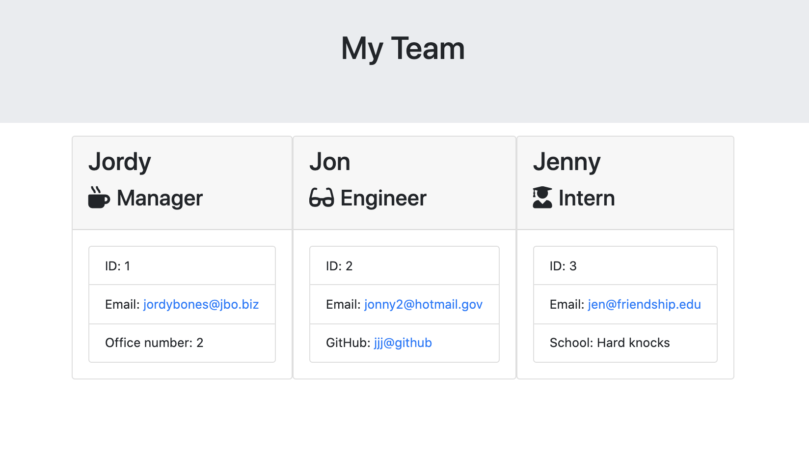

# CommandLineTeamGenerator

This iis a command line node application that generates a page for your team. It prompts the user for the name, id, email, and role for each member of the team, plus additional information unique to each role. It then generates html that nicely displays the input info. 

